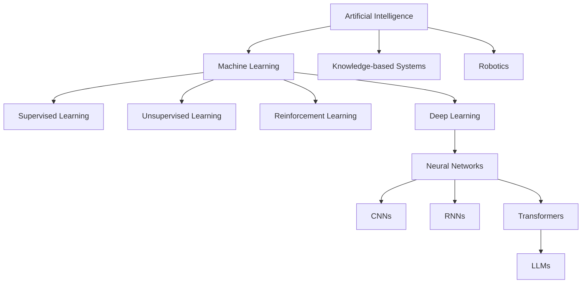
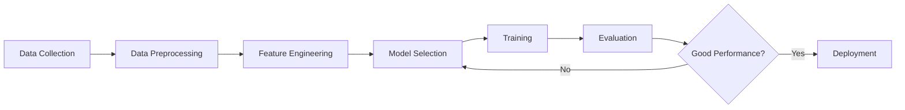
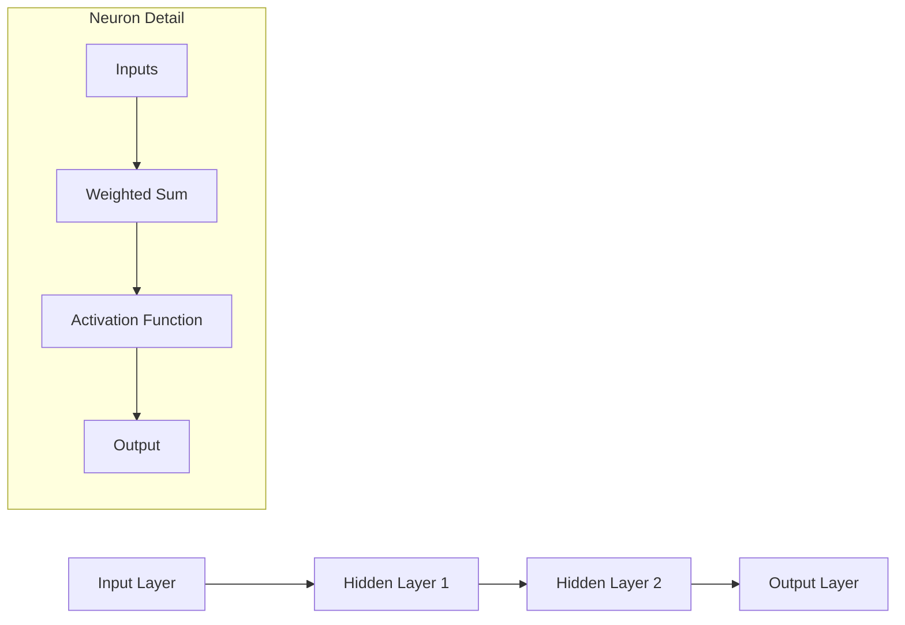
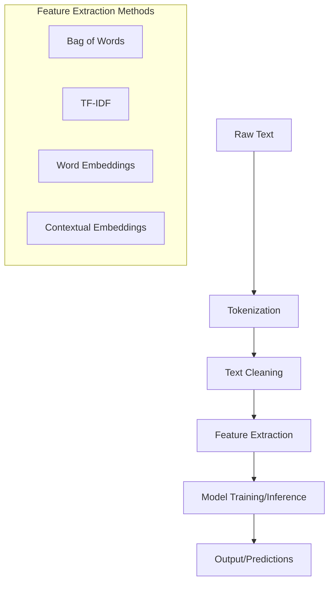
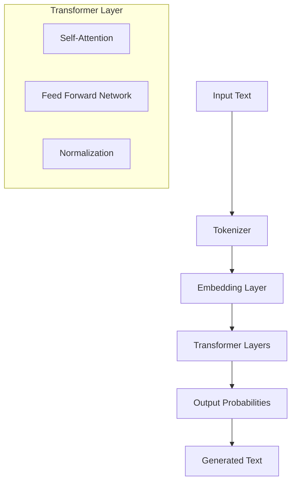
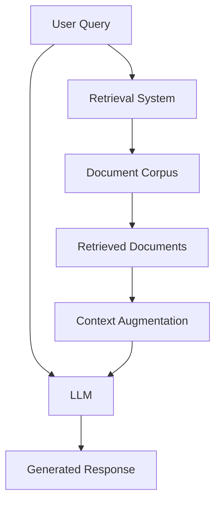
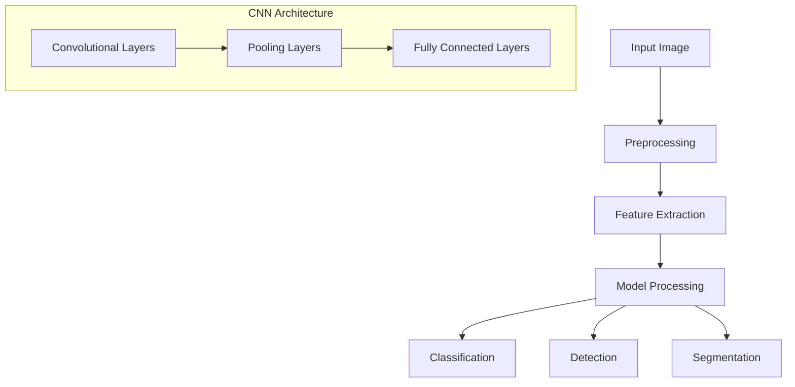
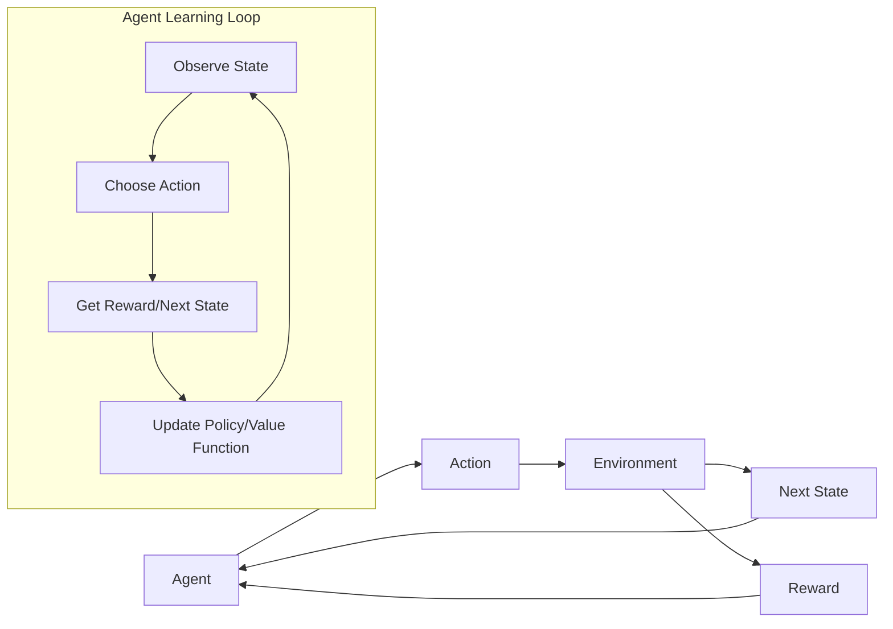
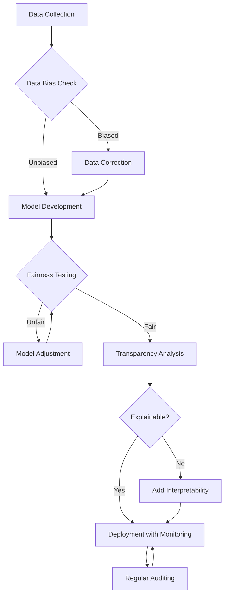
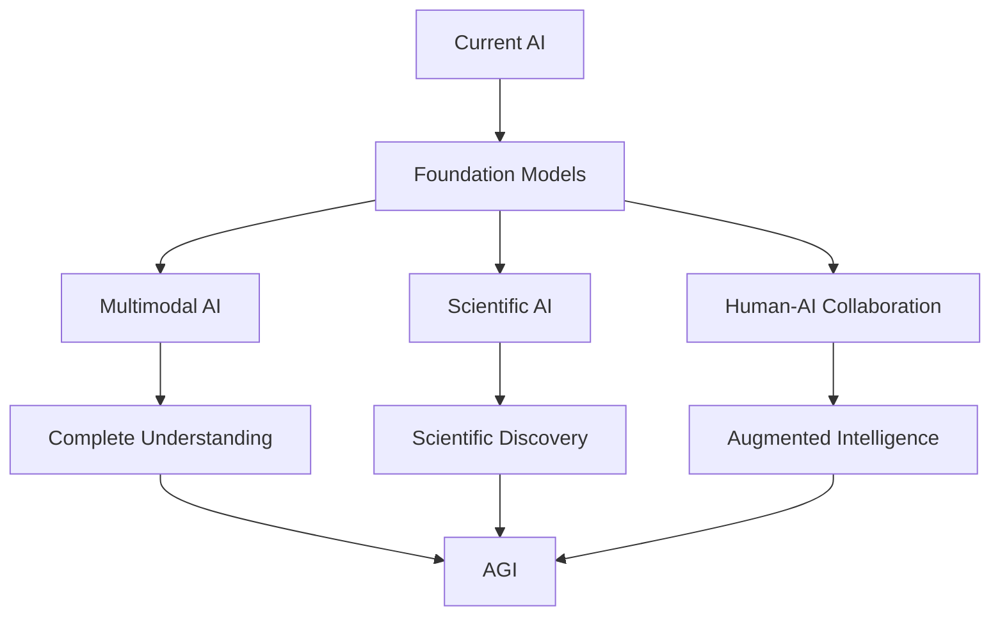

# Comprehensive AI Course for Beginners

## Table of Contents
1. [Introduction to AI](#introduction-to-ai)
2. [Machine Learning Fundamentals](#machine-learning-fundamentals)
3. [Neural Networks and Deep Learning](#neural-networks-and-deep-learning)
4. [Natural Language Processing](#natural-language-processing)
5. [Large Language Models (LLMs)](#large-language-models-llms)
6. [Retrieval-Augmented Generation (RAG)](#retrieval-augmented-generation-rag)
7. [Computer Vision](#computer-vision)
8. [Reinforcement Learning](#reinforcement-learning)
9. [Ethical AI and Responsible Development](#ethical-ai-and-responsible-development)
10. [Future Trends and Advanced Topics](#future-trends-and-advanced-topics)

## Introduction to AI

### What is Artificial Intelligence?
AI refers to systems that can perform tasks that typically require human intelligence, such as visual perception, speech recognition, decision-making, and language translation.

### Brief History of AI
- 1950s: Alan Turing proposes the Turing Test
- 1956: Dartmouth Conference coins the term "Artificial Intelligence"
- 1980s-90s: Expert systems and early machine learning
- 2010s: Deep learning revolution
- 2020s: Large language models and generative AI

### AI Categories
- **Narrow/Weak AI**: Systems designed for specific tasks (e.g., virtual assistants, recommender systems)
- **General/Strong AI**: Hypothetical systems with human-like intelligence across domains
- **Superintelligent AI**: Theoretical systems surpassing human capabilities

### Python Example: Simple AI Concept

```python
# Basic concept of an intelligent agent
class SimpleAI:
    def __init__(self, name):
        self.name = name
        self.knowledge = {}
    
    def learn(self, concept, information):
        self.knowledge[concept] = information
        print(f"{self.name} learned about {concept}")
    
    def recall(self, concept):
        if concept in self.knowledge:
            return f"{self.name} knows that {concept} is {self.knowledge[concept]}"
        else:
            return f"{self.name} doesn't know about {concept}"

# Create and use a simple AI
assistant = SimpleAI("Helper")
assistant.learn("Python", "a high-level programming language")
print(assistant.recall("Python"))
print(assistant.recall("JavaScript"))
```

### AI Landscape: Mermaid Diagram



## Machine Learning Fundamentals

### What is Machine Learning?
Machine learning is a subset of AI that focuses on building systems that learn from data rather than being explicitly programmed.

### Types of Machine Learning
1. **Supervised Learning**: Learning from labeled data
2. **Unsupervised Learning**: Finding patterns in unlabeled data
3. **Reinforcement Learning**: Learning through trial and error with rewards/penalties

### Key Concepts
- **Dataset**: Collection of examples used for training and testing
- **Features**: Input variables used to make predictions
- **Labels**: Output variables the model learns to predict
- **Training**: Process of learning patterns from data
- **Inference**: Using trained model to make predictions on new data

### Python Example: Linear Regression

```python
import numpy as np
import matplotlib.pyplot as plt
from sklearn.linear_model import LinearRegression
from sklearn.model_selection import train_test_split

# Generate sample data
np.random.seed(42)
X = 2 * np.random.rand(100, 1)
y = 4 + 3 * X + np.random.randn(100, 1)

# Split data into training and testing sets
X_train, X_test, y_train, y_test = train_test_split(X, y, test_size=0.2, random_state=42)

# Train a linear regression model
model = LinearRegression()
model.fit(X_train, y_train)

# Evaluate the model
train_score = model.score(X_train, y_train)
test_score = model.score(X_test, y_test)

print(f"Model coefficients: {model.coef_}")
print(f"Model intercept: {model.intercept_}")
print(f"Training score: {train_score}")
print(f"Testing score: {test_score}")

# Plot the results
plt.scatter(X, y, alpha=0.4)
plt.plot(X, model.predict(X), color='red', linewidth=3)
plt.title("Linear Regression Example")
plt.xlabel("X")
plt.ylabel("y")
plt.show()
```

### ML Workflow: Mermaid Diagram



## Neural Networks and Deep Learning

### What are Neural Networks?
Neural networks are computing systems inspired by the biological neural networks in human brains, consisting of nodes (neurons) organized in layers that process and transform input data.

### Components of Neural Networks
- **Neurons**: Basic computation units
- **Layers**: Groups of neurons (Input, Hidden, Output)
- **Weights & Biases**: Parameters that are adjusted during training
- **Activation Functions**: Non-linear functions that determine neuron output

### Deep Learning
Deep learning refers to neural networks with multiple hidden layers, enabling them to learn hierarchical representations of data.

### Python Example: Simple Neural Network with PyTorch

```python
import torch
import torch.nn as nn
import torch.optim as optim
import matplotlib.pyplot as plt

# Create a simple dataset
X = torch.linspace(-5, 5, 100).reshape(-1, 1)
y = torch.sin(X) + 0.1 * torch.randn_like(X)

# Define a neural network
class SimpleNN(nn.Module):
    def __init__(self):
        super().__init__()
        self.layer1 = nn.Linear(1, 16)
        self.layer2 = nn.Linear(16, 16)
        self.layer3 = nn.Linear(16, 1)
        self.activation = nn.ReLU()
        
    def forward(self, x):
        x = self.activation(self.layer1(x))
        x = self.activation(self.layer2(x))
        x = self.layer3(x)
        return x

# Initialize the model and optimizer
model = SimpleNN()
criterion = nn.MSELoss()
optimizer = optim.Adam(model.parameters(), lr=0.01)

# Training loop
epochs = 1000
losses = []

for epoch in range(epochs):
    # Forward pass
    y_pred = model(X)
    loss = criterion(y_pred, y)
    losses.append(loss.item())
    
    # Backward pass and optimize
    optimizer.zero_grad()
    loss.backward()
    optimizer.step()
    
    if epoch % 100 == 0:
        print(f"Epoch {epoch}, Loss: {loss.item():.4f}")

# Plot results
plt.figure(figsize=(12, 5))
plt.subplot(1, 2, 1)
plt.plot(losses)
plt.title("Training Loss")
plt.xlabel("Epoch")
plt.ylabel("Loss")

plt.subplot(1, 2, 2)
plt.scatter(X.numpy(), y.numpy(), label="Data")
plt.plot(X.numpy(), model(X).detach().numpy(), color='red', label="Model")
plt.title("Neural Network Prediction")
plt.legend()
plt.show()
```

### Neural Network Architecture: Mermaid Diagram



## Natural Language Processing

### What is NLP?
Natural Language Processing is a field of AI focused on enabling computers to understand, interpret, and generate human language.

### Key NLP Tasks
- **Text Classification**: Categorizing text into predefined classes
- **Named Entity Recognition**: Identifying entities like names, locations in text
- **Sentiment Analysis**: Determining sentiment/emotion in text
- **Machine Translation**: Translating text between languages
- **Text Generation**: Creating human-like text

### Text Representation
- **Bag of Words**: Simple frequency-based representation
- **TF-IDF**: Term frequency-inverse document frequency
- **Word Embeddings**: Dense vector representations (Word2Vec, GloVe)
- **Contextual Embeddings**: Context-aware representations (BERT, GPT)

### Python Example: Simple Sentiment Analysis

```python
import nltk
from nltk.sentiment import SentimentIntensityAnalyzer
import pandas as pd
import matplotlib.pyplot as plt

# Download NLTK resources
nltk.download('vader_lexicon')

# Initialize the sentiment analyzer
sia = SentimentIntensityAnalyzer()

# Sample texts
texts = [
    "I absolutely love this product! It's amazing.",
    "This movie was good, but a bit too long.",
    "The service was terrible and I'll never go back.",
    "I'm feeling neutral about the recent changes.",
    "The food was not bad, but nothing special."
]

# Analyze sentiment
results = []
for text in texts:
    sentiment = sia.polarity_scores(text)
    results.append({
        'text': text,
        'positive': sentiment['pos'],
        'neutral': sentiment['neu'],
        'negative': sentiment['neg'],
        'compound': sentiment['compound']
    })

# Convert to DataFrame
df = pd.DataFrame(results)
print(df)

# Visualize results
plt.figure(figsize=(10, 6))
plt.bar(range(len(texts)), df['compound'], color=['green' if x > 0 else 'red' for x in df['compound']])
plt.axhline(y=0, color='black', linestyle='-', alpha=0.3)
plt.xticks(range(len(texts)), [f"Text {i+1}" for i in range(len(texts))])
plt.ylabel('Compound Sentiment Score')
plt.title('Sentiment Analysis Results')
plt.show()
```

### NLP Pipeline: Mermaid Diagram



## Large Language Models (LLMs)

### What are LLMs?
Large Language Models are neural networks trained on vast amounts of text data to understand and generate human-like language. Examples include GPT models, LLaMA, and Claude.

### Key Concepts
- **Architecture**: Most modern LLMs use transformer architectures
- **Pre-training**: Initial training on large text corpora
- **Fine-tuning**: Adapting pre-trained models for specific tasks
- **Prompt Engineering**: Crafting effective inputs to get desired outputs
- **Inference**: Generating text responses based on inputs

### How LLMs Work
1. **Tokenization**: Converting text into tokens
2. **Embedding**: Mapping tokens to vector representations
3. **Attention Mechanisms**: Capturing relationships between tokens
4. **Prediction**: Generating probability distributions for next tokens

### Python Example: Using a Simple LLM via Hugging Face

```python
from transformers import pipeline, set_seed

# Initialize a text-generation pipeline with a smaller model
generator = pipeline('text-generation', model='gpt2')
set_seed(42)

# Generate text with different prompts
prompts = [
    "Artificial intelligence is",
    "The future of technology includes",
    "Machine learning allows computers to"
]

for prompt in prompts:
    # Generate text based on the prompt
    generated_text = generator(prompt, max_length=50, num_return_sequences=1)[0]['generated_text']
    print(f"Prompt: {prompt}")
    print(f"Generated: {generated_text}")
    print("-" * 50)
```

### LLM Architecture: Mermaid Diagram



## Retrieval-Augmented Generation (RAG)

### What is RAG?
Retrieval-Augmented Generation combines information retrieval systems with text generation models to produce outputs that are both relevant and factually accurate by retrieving external knowledge.

### Components of RAG
1. **Document Corpus**: Collection of text documents/knowledge
2. **Retriever**: System that finds relevant information
3. **Generator**: LLM that produces text based on input and retrieved information
4. **Knowledge Integration**: Mechanism to combine retrieved information with the generation process

### Advantages of RAG
- Improved factual accuracy
- Reduced hallucinations
- Access to specialized or up-to-date knowledge
- Greater transparency and traceability

### Python Example: Simple RAG Implementation

```python
import numpy as np
from sklearn.feature_extraction.text import TfidfVectorizer
from sklearn.metrics.pairwise import cosine_similarity
from transformers import pipeline

# 1. Create a simple document corpus
documents = [
    "Artificial intelligence is the simulation of human intelligence by machines.",
    "Machine learning is a subset of AI focused on learning from data.",
    "Neural networks are computing systems inspired by biological neural networks.",
    "Deep learning uses neural networks with many layers to learn representations.",
    "Natural language processing enables computers to understand human language.",
    "Computer vision is an AI field that trains computers to interpret visual data."
]

# 2. Create a simple retriever using TF-IDF and cosine similarity
vectorizer = TfidfVectorizer()
document_vectors = vectorizer.fit_transform(documents)

def retrieve(query, top_k=2):
    # Convert query to vector
    query_vector = vectorizer.transform([query])
    
    # Calculate similarity with all documents
    similarities = cosine_similarity(query_vector, document_vectors).flatten()
    
    # Get top-k most similar documents
    top_indices = similarities.argsort()[-top_k:][::-1]
    return [documents[i] for i in top_indices]

# 3. Create a simple generator using GPT-2
generator = pipeline('text-generation', model='gpt2')

# 4. Implement RAG system
def rag_response(query, max_length=100):
    # Retrieve relevant context
    relevant_docs = retrieve(query)
    context = " ".join(relevant_docs)
    
    # Create augmented prompt
    augmented_prompt = f"Context: {context}\n\nQuestion: {query}\n\nAnswer:"
    
    # Generate response
    response = generator(augmented_prompt, max_length=max_length)[0]['generated_text']
    
    # Extract just the answer part
    answer = response.split("Answer:")[-1].strip()
    return answer, relevant_docs

# Test the RAG system
queries = [
    "What is artificial intelligence?",
    "How are neural networks related to deep learning?",
    "What is NLP in artificial intelligence?"
]

for query in queries:
    answer, sources = rag_response(query)
    print(f"Question: {query}")
    print(f"Answer: {answer}")
    print(f"Sources: {sources}")
    print("-" * 50)
```

### RAG Architecture: Mermaid Diagram



## Computer Vision

### What is Computer Vision?
Computer Vision is a field of AI that enables computers to derive meaningful information from digital images, videos, and other visual inputs, and take actions or make recommendations based on that information.

### Key Computer Vision Tasks
- **Image Classification**: Categorizing images into classes
- **Object Detection**: Identifying and locating objects in images
- **Semantic Segmentation**: Labeling each pixel with a category
- **Face Recognition**: Identifying or verifying faces
- **Image Generation**: Creating new images (GANs, Diffusion Models)

### Python Example: Image Classification with a Pre-trained Model

```python
import torch
from torchvision import models, transforms
from PIL import Image
import matplotlib.pyplot as plt
import numpy as np
import requests
from io import BytesIO

# Load a pre-trained ResNet model
model = models.resnet18(pretrained=True)
model.eval()

# Define image transformations
transform = transforms.Compose([
    transforms.Resize(256),
    transforms.CenterCrop(224),
    transforms.ToTensor(),
    transforms.Normalize([0.485, 0.456, 0.406], [0.229, 0.224, 0.225])
])

# Download ImageNet class labels
response = requests.get("https://raw.githubusercontent.com/pytorch/hub/master/imagenet_classes.txt")
categories = [s.strip() for s in response.text.splitlines()]

# Function to predict on an image
def predict_image(image_url):
    # Download and open the image
    response = requests.get(image_url)
    img = Image.open(BytesIO(response.content))
    
    # Preprocess the image
    img_t = transform(img)
    batch_t = torch.unsqueeze(img_t, 0)
    
    # Make prediction
    with torch.no_grad():
        output = model(batch_t)
    
    # Get top predictions
    _, indices = torch.sort(output, descending=True)
    percentages = torch.nn.functional.softmax(output, dim=1)[0] * 100
    
    # Display results
    plt.figure(figsize=(16, 8))
    plt.subplot(1, 2, 1)
    plt.imshow(img)
    plt.axis('off')
    plt.title("Input Image")
    
    plt.subplot(1, 2, 2)
    y_pos = np.arange(5)
    performance = [percentages[idx].item() for idx in indices[0][:5]]
    labels = [categories[idx] for idx in indices[0][:5]]
    plt.barh(y_pos, performance, align='center')
    plt.yticks(y_pos, labels)
    plt.title('Top-5 Predictions')
    plt.xlabel('Probability (%)')
    plt.tight_layout()
    plt.show()
    
    return [(categories[idx], percentages[idx].item()) for idx in indices[0][:5]]

# Test with example images
sample_images = [
    "https://raw.githubusercontent.com/pytorch/hub/master/images/dog.jpg",
    "https://raw.githubusercontent.com/pytorch/hub/master/images/cat.jpg"
]

for img_url in sample_images:
    print(f"Predictions for image: {img_url}")
    predictions = predict_image(img_url)
    for label, prob in predictions:
        print(f"{label}: {prob:.2f}%")
    print("-" * 50)
```

### Computer Vision Pipeline: Mermaid Diagram



## Reinforcement Learning

### What is Reinforcement Learning?
Reinforcement Learning (RL) is a type of machine learning where an agent learns to make decisions by taking actions in an environment to maximize cumulative rewards.

### Key Components
- **Agent**: The decision-maker
- **Environment**: The world in which the agent operates
- **State**: The current situation of the agent
- **Action**: Choices the agent can make
- **Reward**: Feedback from the environment about action quality
- **Policy**: Strategy the agent uses to determine actions

### Types of RL Algorithms
- **Value-Based**: Learn the value of states/actions (Q-Learning)
- **Policy-Based**: Learn a policy directly
- **Model-Based**: Learn a model of the environment
- **Deep RL**: Combining deep learning with RL (DQN, PPO)

### Python Example: Q-Learning for Grid World

```python
import numpy as np
import matplotlib.pyplot as plt
import seaborn as sns

# Define a simple grid world environment
class GridWorld:
    def __init__(self, size=5):
        self.size = size
        self.actions = ["up", "right", "down", "left"]
        self.reset()
        
        # Define goal and obstacle positions
        self.goal = (size-1, size-1)
        self.obstacles = [(1, 1), (2, 1), (3, 1), (1, 3), (2, 3), (3, 3)]
        
    def reset(self):
        self.state = (0, 0)
        return self.state
    
    def get_next_state(self, state, action):
        x, y = state
        if action == "up":
            y = max(0, y - 1)
        elif action == "right":
            x = min(self.size - 1, x + 1)
        elif action == "down":
            y = min(self.size - 1, y + 1)
        elif action == "left":
            x = max(0, x - 1)
        return (x, y)
    
    def step(self, action):
        next_state = self.get_next_state(self.state, action)
        
        # Check if next state is an obstacle
        if next_state in self.obstacles:
            reward = -10
            next_state = self.state  # Stay in current state
        # Check if next state is the goal
        elif next_state == self.goal:
            reward = 100
        # Small penalty for each step to encourage efficiency
        else:
            reward = -1
            
        self.state = next_state
        done = (self.state == self.goal)
        
        return next_state, reward, done
    
    def render(self, q_table=None):
        grid = np.zeros((self.size, self.size))
        
        # Mark obstacles
        for x, y in self.obstacles:
            grid[y, x] = -1
            
        # Mark goal
        grid[self.goal[1], self.goal[0]] = 2
        
        # Mark agent
        grid[self.state[1], self.state[0]] = 1
        
        plt.figure(figsize=(10, 10))
        
        # Plot the grid world
        sns.heatmap(grid, cmap=plt.cm.RdYlGn, annot=False, cbar=False)
        
        # If Q-table is provided, plot arrows for optimal actions
        if q_table is not None:
            for i in range(self.size):
                for j in range(self.size):
                    if (j, i) in self.obstacles or (j, i) == self.goal:
                        continue
                    
                    # Get best action from Q-table
                    state_q_values = [q_table.get(((j, i), a), 0) for a in range(len(self.actions))]
                    best_action = np.argmax(state_q_values)
                    
                    # Plot arrow
                    if best_action == 0:  # up
                        plt.arrow(j + 0.5, i + 0.7, 0, -0.4, head_width=0.1, head_length=0.1, fc='white', ec='white')
                    elif best_action == 1:  # right
                        plt.arrow(j + 0.3, i + 0.5, 0.4, 0, head_width=0.1, head_length=0.1, fc='white', ec='white')
                    elif best_action == 2:  # down
                        plt.arrow(j + 0.5, i + 0.3, 0, 0.4, head_width=0.1, head_length=0.1, fc='white', ec='white')
                    elif best_action == 3:  # left
                        plt.arrow(j + 0.7, i + 0.5, -0.4, 0, head_width=0.1, head_length=0.1, fc='white', ec='white')
        
        plt.title("Grid World")
        plt.show()

# Q-Learning algorithm
def q_learning(env, episodes=1000, alpha=0.1, gamma=0.99, epsilon=0.1):
    # Initialize Q-table
    q_table = {}
    
    # Initialize lists to track rewards and steps
    rewards_per_episode = []
    steps_per_episode = []
    
    for episode in range(episodes):
        state = env.reset()
        total_reward = 0
        steps = 0
        done = False
        
        while not done:
            # Epsilon-greedy action selection
            if np.random.uniform(0, 1) < epsilon:
                action = np.random.choice(range(len(env.actions)))
            else:
                state_q_values = [q_table.get((state, a), 0) for a in range(len(env.actions))]
                action = np.argmax(state_q_values)
                
            # Take action and observe next state and reward
            next_state, reward, done = env.step(env.actions[action])
            
            # Q-value update
            old_q_value = q_table.get((state, action), 0)
            next_max = max([q_table.get((next_state, a), 0) for a in range(len(env.actions))])
            
            new_q_value = old_q_value + alpha * (reward + gamma * next_max - old_q_value)
            q_table[(state, action)] = new_q_value
            
            state = next_state
            total_reward += reward
            steps += 1
            
            if steps > 100:  # Limit episode length
                break
                
        rewards_per_episode.append(total_reward)
        steps_per_episode.append(steps)
        
        # Print progress
        if (episode + 1) % 100 == 0:
            print(f"Episode {episode + 1}/{episodes}, Avg Reward: {np.mean(rewards_per_episode[-100:]):.2f}, Avg Steps: {np.mean(steps_per_episode[-100:]):.2f}")
    
    return q_table, rewards_per_episode, steps_per_episode

# Create environment and train agent
env = GridWorld(size=5)
print("Initial environment:")
env.render()

q_table, rewards, steps = q_learning(env, episodes=500)

# Plot learning curves
plt.figure(figsize=(12, 5))
plt.subplot(1, 2, 1)
plt.plot(rewards)
plt.title('Rewards per Episode')
plt.xlabel('Episode')
plt.ylabel('Total Reward')

plt.subplot(1, 2, 2)
plt.plot(steps)
plt.title('Steps per Episode')
plt.xlabel('Episode')
plt.ylabel('Steps')
plt.tight_layout()
plt.show()

# Show learned policy
print("Environment with learned policy:")
env.reset()
env.render(q_table)

# Test the learned policy
print("Testing learned policy:")
state = env.reset()
done = False
total_reward = 0
step = 0

while not done and step < 20:
    # Choose best action from Q-table
    state_q_values = [q_table.get((state, a), 0) for a in range(len(env.actions))]
    action = np.argmax(state_q_values)
    
    # Take action
    next_state, reward, done = env.step(env.actions[action])
    
    state = next_state
    total_reward += reward
    step += 1
    
    print(f"Step {step}: Action={env.actions[action]}, State={state}, Reward={reward}")
    
    if done:
        print(f"Goal reached in {step} steps with total reward {total_reward}")
```

### Reinforcement Learning Process: Mermaid Diagram



## Ethical AI and Responsible Development

### AI Ethics Concerns
- **Bias and Fairness**: Ensuring AI systems are equitable
- **Transparency**: Understanding AI decisions
- **Privacy**: Protecting sensitive data
- **Accountability**: Responsibility for AI actions
- **Job Displacement**: Economic impacts of automation
- **Autonomous Systems**: Ethical decision-making in robots/vehicles

### Responsible AI Development
- **Diverse Training Data**: Ensuring representative datasets
- **Fairness Testing**: Evaluating systems for bias
- **Interpretable Models**: Using explainable AI techniques
- **Human Oversight**: Keeping humans in the loop
- **Regular Auditing**: Continuous evaluation of AI systems

### AI Ethics Framework: Python Example

```python
import pandas as pd
import numpy as np
from sklearn.model_selection import train_test_split
from sklearn.ensemble import RandomForestClassifier
from sklearn.metrics import confusion_matrix, classification_report
import matplotlib.pyplot as plt
import seaborn as sns

# Create a synthetic dataset with potential bias
np.random.seed(42)
n_samples = 1000

# Create features
age = np.random.normal(40, 15, n_samples)
income = np.random.normal(50000, 20000, n_samples)
education_years = np.random.normal(14, 3, n_samples)

# Create biased target (loan approval more likely for higher income)
probability = 1 / (1 + np.exp(-(income - 50000) / 20000))
loan_approved = np.random.binomial(1, probability)

# Create sensitive attribute (gender)
gender = np.random.binomial(1, 0.5, n_samples)

# Add bias: make income correlated with gender
income = income + gender * 10000

# Create DataFrame
data = pd.DataFrame({
    'age': age,
    'income': income,
    'education_years': education_years,
    'gender': gender,
    'loan_approved': loan_approved
})

# Analyze dataset for bias
print("Average income by gender:")
print(data.groupby('gender')['income'].mean())

print("\nLoan approval rate by gender:")
print(data.groupby('gender')['loan_approved'].mean())

# Split data for training
X = data[['age', 'income', 'education_years']]
y = data['loan_approved']

X_train, X_test, y_train, y_test = train_test_split(
    X, y, test_size=0.2, random_state=42
)

# Train a model
model = RandomForestClassifier(random_state=42)
model.fit(X_train, y_train)

# Evaluate overall performance
y_pred = model.predict(X_test)
print("\nOverall model performance:")
print(classification_report(y_test, y_pred))

# Fairness evaluation
test_data = X_test.copy()
test_data['gender'] = data.loc[X_test.index, 'gender']
test_data['loan_approved_actual'] = y_test
test_data['loan_approved_predicted'] = y_pred

# Calculate approval rates by gender
fairness_metrics = test_data.groupby('gender').agg({
    'loan_approved_actual': 'mean',
    'loan_approved_predicted': 'mean'
}).reset_index()

fairness_metrics.columns = ['gender', 'actual_approval_rate', 'predicted_approval_rate']
print("\nFairness evaluation by gender:")
print(fairness_metrics)

# Visualize the fairness evaluation
plt.figure(figsize=(10, 6))
sns.barplot(x='gender', y='value', hue='variable', 
            data=pd.melt(fairness_metrics, id_vars=['gender'], 
                         value_vars=['actual_approval_rate', 'predicted_approval_rate']))
plt.title('Loan Approval Rates by Gender: Actual vs Predicted')
plt.ylabel('Approval Rate')
plt.xlabel('Gender (0=Female, 1=Male)')
plt.ylim(0, 1)
plt.show()

# Feature importance
feature_importance = pd.DataFrame({
    'Feature': X.columns,
    'Importance': model.feature_importances_
}).sort_values('Importance', ascending=False)

plt.figure(figsize=(10, 6))
sns.barplot(x='Importance', y='Feature', data=feature_importance)
plt.title('Feature Importance')
plt.tight_layout()
plt.show()

# Mitigation: Create a more balanced model
# One approach: Remove income (which is biased) from the features
X_fair = data[['age', 'education_years']]

X_train_fair, X_test_fair, y_train, y_test = train_test_split(
    X_fair, y, test_size=0.2, random_state=42
)

# Train a new model
fair_model = RandomForestClassifier(random_state=42)
fair_model.fit(X_train_fair, y_train)

# Evaluate the fair model
y_pred_fair = fair_model.predict(X_test_fair)

# Calculate approval rates by gender for the fair model
test_data_fair = X_test_fair.copy()
test_data_fair['gender'] = data.loc[X_test_fair.index, 'gender']
test_data_fair['loan_approved_actual'] = y_test
test_data_fair['loan_approved_predicted'] = y_pred_fair

fairness_metrics_fair = test_data_fair.groupby('gender').agg({
    'loan_approved_actual': 'mean',
    'loan_approved_predicted': 'mean'
}).reset_index()

fairness_metrics_fair.columns = ['gender', 'actual_approval_rate', 'predicted_approval_rate']
print("\nFairness evaluation by gender (fair model):")
print(fairness_metrics_fair)

print("\nComparison of disparity in predicted approval rates:")
original_disparity = abs(fairness_metrics.iloc[1]['predicted_approval_rate'] - 
                       fairness_metrics.iloc[0]['predicted_approval_rate'])
fair_disparity = abs(fairness_metrics_fair.iloc[1]['predicted_approval_rate'] - 
                    fairness_metrics_fair.iloc[0]['predicted_approval_rate'])

print(f"Original model disparity: {original_disparity:.4f}")
print(f"Fair model disparity: {fair_disparity:.4f}")
print(f"Improvement: {(1 - fair_disparity/original_disparity)*100:.2f}%")
```

### AI Ethics Framework: Mermaid Diagram



## Future Trends and Advanced Topics

### Cutting-Edge AI Research Areas
- **Multimodal Models**: Working with multiple types of data (text, images, audio)
- **Neuromorphic Computing**: Hardware designed to mimic brain functions
- **Quantum Machine Learning**: Using quantum computing for ML algorithms
- **Federated Learning**: Training models across devices while preserving privacy
- **AI for Science**: Using AI for scientific discovery (protein folding, climate models)
- **Foundation Models**: Large pre-trained models adaptable to many tasks

### Example: Vision-Language Models
Vision-language models combine image understanding with text generation, enabling them to describe images, answer questions about visual content, and follow instructions based on visual inputs.

### Emerging Applications
- **AI for Healthcare**: Disease diagnosis, drug discovery, personalized treatment
- **Autonomous Systems**: Self-driving vehicles, drones, robots
- **Creative AI**: Art, music, and content generation
- **AI for Sustainability**: Climate modeling, resource optimization
- **Augmented Intelligence**: AI that enhances human capabilities rather than replacing them

### Future Trends: Mermaid Diagram



## Resources for Further Learning

### Books
- **"Deep Learning" by Ian Goodfellow, Yoshua Bengio, and Aaron Courville**
- **"Hands-On Machine Learning with Scikit-Learn, Keras, and TensorFlow" by Aurélien Géron**
- **"Artificial Intelligence: A Modern Approach" by Stuart Russell and Peter Norvig**

### Online Courses
- **Andrew Ng's Machine Learning courses on Coursera**
- **Fast.ai courses for practical deep learning**
- **Hugging Face courses for NLP and transformers**

### Platforms and Tools
- **Kaggle**: Competitions and datasets
- **Google Colab**: Free cloud-based notebooks
- **Hugging Face**: Pre-trained models and tools
- **PyTorch and TensorFlow**: Leading deep learning frameworks

### Communities
- **AI research papers on arXiv**
- **Machine Learning subreddit**
- **Stack Overflow for coding questions**
- **GitHub repositories of popular AI projects**

Remember that AI is a rapidly evolving field, so continuous learning is essential to stay up-to-date with the latest advancements.
